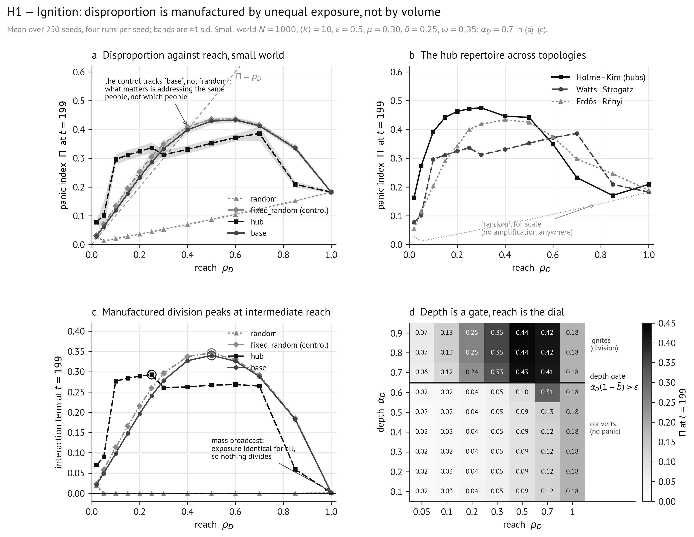

# H1 — Ignition: panic starts through structure, not persuasion

**Experiment A of spec §12.1. Tests the hypothesis stated in spec §13.**

> **H1.** Which repertoire ignites a panic depends on network topology, and ignition is
> *amplifying but not discontinuous*: disproportion rises faster than one-for-one with reach,
> so that $\Pi>\rho_D$ across the usable range, while the response stays smooth and saturating
> rather than jumping at a critical value.

All tables below are generated by `../Code/make_report_tables.py h1` from
`data/h1_ignition.json`; none is transcribed by hand.

---

## 1. Design

| Item | Value |
|---|---|
| Population | $N=1000$, mean degree 10, full graph (not the giant component) |
| Topologies | Watts–Strogatz ($p=0.1$), Holme–Kim ($m=5$, $p_\triangle=0.5$), Erdős–Rényi |
| Repertoires | `random`, `hub`, `base`, and the `fixed_random` control (spec §7.1) |
| Reach $\rho_D$ | 0.02, 0.05, 0.10, 0.15, 0.20, 0.25, 0.30, 0.40, 0.50, 0.60, 0.70, 0.85, 1.00 |
| Depth $\alpha_D$ | 0.7 in the reach sweeps; 0.1–0.9 in the depth × reach grid |
| Alarm parameters | $\epsilon=0.5$, $\mu=0.30$, $\delta=0.25$, $\omega=0.35$ |
| Constants | $\sigma=0$, $\gamma=3$, $\zeta=0.01$ |
| Horizon | $T=200$ steps, $D$ active throughout; $\Pi$ read at $t=199$ |
| Seeds | **250** per cell (125 in the depth × reach grid), four runs each |
| Counter-entrepreneur | silent ($\rho_C=0$) |

59 875 counterfactual sets, i.e. 239 500 simulation runs. At 250 seeds the Monte Carlo
standard error on panic incidence is at most $\pm0.032$, which is the tolerance spec §12.1
asks for.

Realised structure: $\langle k\rangle$ = 10.00 / 9.94 / 9.88, clustering 0.487 / 0.212 /
0.010, one component and zero isolates in all three generators. Degree dispersion, which is
what `hub` was supposed to trade on, differs sharply: s.d. 1.00 (Watts–Strogatz), 12.81
(Holme–Kim), 3.22 (Erdős–Rényi); the largest degree is 13, 171 and 24 respectively.

**Conditioning.** The C3 sub-criticality probe (spec §3.3) passes at the operating point:
$\mu+\delta=0.55$ and seeded contagion dies to a resting mean alarm of $4\times10^{-53}$.
$\bar\Phi(0)=0.067$, matching the $\approx0.07$ the spec predicts for the consensual regime
(§8), so pre-existing division is negligible by construction.

---

## 2. Results

### 2.1 Disproportion against reach, by repertoire (Watts–Strogatz)

$\Pi$ at $t=199$, mean ± s.d. over 250 seeds; the amplification ratio $\Pi/\rho_D$ in brackets.

| $\rho_D$ | `random` | `fixed_random` | `hub` | `base` |
|---|---|---|---|---|
| 0.02 | 0.027 ± 0.005 (1.35) | 0.031 ± 0.003 (1.57) | **0.078 ± 0.009 (3.88)** | 0.029 ± 0.003 (1.46) |
| 0.05 | 0.012 ± 0.000 (0.25) | 0.071 ± 0.005 (1.41) | **0.101 ± 0.047 (2.03)** | 0.062 ± 0.007 (1.24) |
| 0.10 | 0.020 ± 0.000 (0.20) | 0.134 ± 0.009 (1.34) | **0.296 ± 0.018 (2.96)** | 0.119 ± 0.011 (1.19) |
| 0.15 | 0.028 ± 0.000 (0.19) | 0.195 ± 0.014 (1.30) | **0.311 ± 0.017 (2.07)** | 0.177 ± 0.015 (1.18) |
| 0.20 | 0.036 ± 0.000 (0.18) | 0.253 ± 0.014 (1.27) | **0.324 ± 0.017 (1.62)** | 0.234 ± 0.018 (1.17) |
| 0.25 | 0.044 ± 0.001 (0.18) | 0.306 ± 0.022 (1.22) | 0.336 ± 0.019 (1.34) | 0.287 ± 0.019 (1.15) |
| 0.30 | 0.053 ± 0.001 (0.18) | **0.350 ± 0.014 (1.17)** | 0.312 ± 0.015 (1.04) | 0.333 ± 0.019 (1.11) |
| 0.40 | 0.070 ± 0.001 (0.17) | **0.409 ± 0.012 (1.02)** | 0.331 ± 0.014 (0.83) | 0.399 ± 0.016 (1.00) |
| 0.50 | 0.087 ± 0.001 (0.17) | **0.435 ± 0.009 (0.87)** | 0.352 ± 0.013 (0.70) | 0.429 ± 0.011 (0.86) |
| 0.60 | 0.105 ± 0.002 (0.17) | **0.436 ± 0.008 (0.73)** | 0.372 ± 0.013 (0.62) | 0.433 ± 0.009 (0.72) |
| 0.70 | 0.123 ± 0.002 (0.18) | 0.416 ± 0.008 (0.59) | 0.386 ± 0.024 (0.55) | 0.413 ± 0.009 (0.59) |
| 0.85 | 0.152 ± 0.003 (0.18) | 0.337 ± 0.010 (0.40) | 0.209 ± 0.010 (0.25) | 0.335 ± 0.009 (0.39) |
| 1.00 | 0.182 ± 0.004 (0.18) | 0.182 ± 0.004 (0.18) | 0.182 ± 0.004 (0.18) | 0.182 ± 0.004 (0.18) |

At $\rho_D=1$ every repertoire is the same rule, so they coincide exactly, as they must.

### 2.2 Peak disproportion, by repertoire × topology

| Topology | degree s.d. | `random` | `fixed_random` | `hub` | `base` |
|---|---|---|---|---|---|
| Watts–Strogatz | 1.00 | 0.182 at $\rho=1.00$ | 0.436 at $\rho=0.60$ | 0.386 at $\rho=0.70$ | 0.433 at $\rho=0.60$ |
| Holme–Kim | 12.81 | 0.209 at $\rho=1.00$ | 0.444 at $\rho=0.60$ | **0.475 at $\rho=0.30$** | 0.435 at $\rho=0.60$ |
| Erdős–Rényi | 3.22 | 0.189 at $\rho=1.00$ | 0.447 at $\rho=0.60$ | 0.433 at $\rho=0.40$ | 0.439 at $\rho=0.60$ |

### 2.3 The fixed-audience control: schedule against degree

The control shares `random`'s selection rule and `hub`'s exposure schedule (spec §7.1), so
`random` → `fixed_random` isolates the *schedule* and `fixed_random` → `hub` isolates *degree*.
Watts–Strogatz, degree s.d. 1.00 — the graph on which H1 predicted `hub` would degenerate.

| $\rho_D$ | `random` | `fixed_random` | `hub` | schedule effect | degree effect |
|---|---|---|---|---|---|
| 0.02 | 0.027 | 0.031 | 0.078 | 1.2× | **2.47×** |
| 0.05 | 0.012 | 0.071 | 0.101 | 5.7× | 1.43× |
| 0.10 | 0.020 | 0.134 | 0.296 | 6.6× | **2.20×** |
| 0.15 | 0.028 | 0.195 | 0.311 | 6.9× | 1.59× |
| 0.20 | 0.036 | 0.253 | 0.324 | **7.0×** | 1.28× |
| 0.25 | 0.044 | 0.306 | 0.336 | 6.9× | 1.10× |
| 0.30 | 0.053 | 0.350 | 0.312 | 6.6× | **0.89×** |
| 0.40 | 0.070 | 0.409 | 0.331 | 5.9× | **0.81×** |
| 0.50 | 0.087 | 0.435 | 0.352 | 5.0× | **0.81×** |
| 0.70 | 0.123 | 0.416 | 0.386 | 3.4× | 0.93× |
| 1.00 | 0.182 | 0.182 | 0.182 | 1.0× | 1.00× |

Exposure concentration $\mathrm{Var}_i(\sum_t g^D_i)$ at $\rho=0.10$:

| Topology | `random` | `fixed_random` | `hub` | `base` |
|---|---|---|---|---|
| Watts–Strogatz | 18 | 3 600 | 2 272 | 3 567 |
| Holme–Kim | 18 | 3 600 | 3 519 | 3 569 |
| Erdős–Rényi | 18 | 3 600 | 3 224 | 3 443 |

3 600 is the maximum attainable at $\rho=0.10$ over 200 steps, and `fixed_random` attains it
by construction. **`hub` is *less* concentrated than the control on every topology** — its
audience churns where degrees tie — and still outperforms it at low reach, which is what
identifies the residual as degree rather than schedule.

### 2.4 Depth against reach

$\Pi$ at $t=199$ / mean position $\bar b$; `base`, Watts–Strogatz, 125 seeds.

| $\alpha_D$ \\ $\rho_D$ | 0.05 | 0.10 | 0.20 | 0.30 | 0.50 | 0.70 | 1.00 |
|---|---|---|---|---|---|---|---|
| 0.1 | 0.017 / +0.54 | 0.025 / +0.79 | 0.041 / +0.95 | 0.054 / +0.98 | 0.089 / +0.98 | 0.125 / +0.99 | 0.183 / +0.99 |
| 0.3 | 0.018 / +0.56 | 0.024 / +0.89 | 0.037 / +0.98 | 0.054 / +0.98 | 0.088 / +0.99 | 0.124 / +0.99 | 0.182 / +0.99 |
| 0.5 | 0.018 / +0.62 | 0.024 / +0.92 | 0.037 / +0.98 | 0.054 / +0.99 | 0.088 / +0.99 | 0.129 / +0.99 | 0.183 / +0.99 |
| 0.6 | 0.020 / +0.56 | 0.024 / +0.90 | 0.037 / +0.98 | 0.054 / +0.99 | 0.103 / +0.97 | **0.315 / +0.80** | 0.183 / +0.99 |
| **0.7** | **0.063 / +0.16** | **0.120 / +0.19** | **0.235 / +0.26** | **0.333 / +0.34** | **0.429 / +0.51** | 0.413 / +0.70 | 0.183 / +0.99 |
| 0.8 | 0.071 / +0.05 | 0.134 / +0.10 | 0.254 / +0.20 | 0.352 / +0.30 | 0.436 / +0.50 | 0.417 / +0.70 | 0.182 / +0.99 |
| 0.9 | 0.071 / +0.05 | 0.134 / +0.10 | 0.254 / +0.20 | 0.352 / +0.30 | 0.436 / +0.50 | 0.417 / +0.70 | 0.182 / +0.99 |

### 2.5 The interaction term against reach (Watts–Strogatz)

| repertoire | 0.05 | 0.10 | 0.20 | 0.30 | 0.40 | 0.50 | 0.70 | 0.85 | 1.00 |
|---|---|---|---|---|---|---|---|---|---|
| `random` | −0.000 | −0.000 | −0.000 | −0.001 | −0.001 | −0.001 | −0.000 | −0.000 | 0.002 |
| `fixed_random` | 0.058 | 0.113 | 0.215 | 0.296 | 0.337 | **0.346** | 0.292 | 0.185 | 0.002 |
| `hub` | 0.089 | 0.277 | 0.289 | 0.261 | 0.262 | 0.267 | 0.265 | 0.059 | 0.002 |
| `base` | 0.049 | 0.098 | 0.196 | 0.278 | 0.327 | **0.340** | 0.288 | 0.183 | 0.002 |

### 2.6 Threshold dispersion and the initial position regime

| $\rho_D$ | dispersed $\theta$ | uniform $\theta=0.5$ | consensual $b(0)$ | polarized $b(0)$ |
|---|---|---|---|---|
| 0.05 | 0.062 ± 0.007 | 0.047 ± 0.002 | 0.062 ± 0.007 | **0.542 ± 0.007** |
| 0.10 | 0.119 ± 0.011 | 0.084 ± 0.004 | 0.119 ± 0.011 | **0.556 ± 0.006** |
| 0.25 | 0.287 ± 0.019 | 0.178 ± 0.007 | 0.287 ± 0.019 | **0.566 ± 0.005** |
| 0.50 | 0.429 ± 0.011 | 0.262 ± 0.005 | 0.429 ± 0.011 | 0.570 ± 0.004 |
| 0.70 | 0.413 ± 0.009 | 0.260 ± 0.002 | 0.413 ± 0.009 | 0.543 ± 0.004 |
| 1.00 | 0.182 ± 0.004 | 0.148 ± 0.000 | 0.182 ± 0.004 | 0.184 ± 0.004 |

### 2.7 Panic incidence over the criterion grid

`base`, Watts–Strogatz, $W=10$; 250 seeds, so the standard error is at most $\pm0.032$.

| $\rho_D$ | $\Pi^*=0.2,q^*=0.2$ | $\Pi^*=0.2,q^*=0.3$ | $\Pi^*=0.3,q^*=0.2$ | $\Pi^*=0.3,q^*=0.3$ | $\Pi^*=0.4,q^*=0.3$ |
|---|---|---|---|---|---|
| 0.10 | 0.00 | 0.00 | 0.00 | 0.00 | 0.00 |
| 0.15 | 0.08 | 0.00 | 0.00 | 0.00 | 0.00 |
| 0.20 | 0.96 | 0.00 | 0.00 | 0.00 | 0.00 |
| 0.25 | 1.00 | 0.38 | 0.40 | 0.32 | 0.00 |
| 0.30 | 1.00 | 0.94 | 1.00 | 0.94 | 0.00 |
| 0.40 | 1.00 | 1.00 | 1.00 | 1.00 | 0.59 |
| 0.50–0.70 | 1.00 | 1.00 | 1.00 | 1.00 | 0.92–1.00 |
| 0.85 | 1.00 | 0.94 | 1.00 | 0.94 | 0.00 |
| 1.00 | 0.00 | 0.00 | 0.00 | 0.00 | 0.00 |

---

## 3. Comments to visualization

*Figure 1, produced by [`hypothesis_figures.ipynb`](hypothesis_figures.ipynb). Mean over 250
seeds, four runs per seed; bands are ±1 s.d.*

Each panel carries one separable clause of H1, and the two clauses the hypothesis got wrong
are visible rather than argued.

**Panel (a) — amplification, and the control that reinterprets it.** Disproportion against
reach for the four repertoires on the small world, with the diagonal $\Pi=\rho_D$ drawn in.
The diagonal is the test: a point above it is a response larger than the forcing that produced
it, which is this model's formal counterpart of Goode & Ben-Yehuda's disproportionality (§1.4,
pattern 1). `hub` clears it from the smallest reach tested; `base` and `fixed_random` clear it
to $\rho\approx0.4$; `random` (light dotted, triangles) never clears it at all, running at a
flat $\Pi/\rho\approx0.18$ — the signature of pure injection with no amplification.

The reading that matters is which curves lie on top of each other. **`fixed_random` traces
`base` almost exactly across the whole sweep**, and both sit far above `random`. Those two
repertoires have nothing in common except that each addresses a stable audience; the control
selects uniformly at random and carries no degree signal whatever. So the amplification is not
about *whom* you reach but about reaching *the same people*.

The second thing to read is shape. Every curve is smooth, single-peaked and saturating; none
jumps. That is the "amplifying but not discontinuous" half of H1, and it matters because the
incidence table in §2.7 goes from 0.08 to 0.96 between $\rho=0.15$ and $\rho=0.20$ while the
underlying $\Pi$ moves smoothly from 0.177 to 0.234. Thresholding a smooth quantity with small
variance manufactures the discontinuity. At 250 seeds that is now a statement about a rate
with a standard error of ±0.032, not about a shape.

**Panel (b) — the topology clause, and where it breaks.** `hub` alone across the three
generators, with `random` repeated as a light dotted reference. H1 predicted `hub` would ignite
fastest where hubs exist and *degenerate to `random`* where degrees are even. The first holds:
Holme–Kim (solid, degree s.d. 12.8) sits above the other two through the low-reach region and
peaks highest at 0.475. The second fails visibly: the Watts–Strogatz curve, on a graph whose
degree s.d. is 1.00 and whose maximum degree is 13, is an order of magnitude above the
`random` reference. If `hub` were trading on degree alone, those two would coincide here.

**Panel (c) — why mass broadcast cannot make a panic.** The interaction term — alarm existing
only because claims-making and othering are both present, i.e. manufactured division — against
reach, with circles at each peak. Both stable-audience repertoires peak at $\rho=0.50$ and
decline; `hub` peaks earlier and lower; and all four collapse to 0.002 at $\rho=1$, where they
are the same rule and exposure variance is exactly zero. `random` lying flat on zero across the
entire sweep is the same point in its purest form: undifferentiated address manufactures no
division at any reach.

**Panel (d) — the clause that turned out to be about the other axis.** $\Pi$ on the
$\alpha_D\times\rho_D$ grid, darker being higher, with the heavy rule where a reached agent's
one-step displacement $\alpha_D(1-\bar b)$ crosses the tolerance $\epsilon=0.5$. Read
row-wise: below the rule everything is pale and flat, 0.02–0.13 regardless of reach, because
there the entrepreneur *converts* — reached agents stay inside their neighbours' tolerance and
drag the population to the pole together ($\bar b\to0.99$). Above the rule the rows are nearly
identical (0.70, 0.80 and 0.90 differ by <0.02) while moving along a row changes $\Pi$
six-fold. **Depth is a gate and reach is the dial.** The single cell at
$\alpha=0.6,\rho=0.7$ reading 0.315 is the gate's own edge, and the fine sweep of
[H2 §2.4](H2_handover.md) locates it between $\alpha=0.62$ and $\alpha=0.68$.

**How the panels connect.** All four read the same mechanism, the asymmetry of §7.4: a
neighbour beyond your tolerance contributes nothing to your position and the most to your
alarm. Panel (d) says when that asymmetry switches on (depth above tolerance), panels (a) and
(b) say who can switch it on (anyone with a stable audience), and panel (c) says how much it
produces (peaking at intermediate reach, vanishing at full reach).

---

## 4. Verdict, clause by clause

| # | Clause as specified | Result | Verdict |
|---|---|---|---|
| a | Which repertoire ignites depends on topology | `hub`'s peak varies 0.386 → 0.475 across generators; `base`, `fixed_random` and `random` vary by <0.02 | **Supported**, but topology-dependence belongs to `hub` alone |
| b | Amplifying: $\Pi>\rho_D$ across the usable range | Holds for `hub` ($\rho\le0.30$), `fixed_random` and `base` ($\rho\le0.40$); fails for `random` at every reach ($\Pi/\rho\approx0.18$, flat) | **Partly supported** — amplification is a property of a *stable audience*, not of claims-making as such |
| b′ | Not discontinuous; smooth and saturating | Smooth and single-peaked at every topology and repertoire | **Supported** |
| c | `hub` ignites fastest in hub-dominated networks | Peak $\Pi$ 0.475 (Holme–Kim) > 0.433 (Erdős–Rényi) > 0.386 (Watts–Strogatz) | **Supported** |
| c′ | …and degenerates to `random` where degrees are even | At degree s.d. 1.00, `hub` beats `random` by up to 14.8×, and the `fixed_random` control recovers 45–100% of that advantage with no degree signal at all | **Refuted**, with the mechanism now identified: see §5 |
| d | `base` ignites at lower reach than `random` | `random` never ignites in the tested region; `base` amplifies from $\rho=0.02$ | **Supported, more strongly than stated** |
| e | Reach dominates depth above a threshold | Above $\alpha_D\approx0.7$, $\Pi$ is flat in $\alpha$ and rises with $\rho$; below it no reach ignites | **Supported, conditionally** — depth is a gate, reach is the dial |
| f | Manufactured division peaks at intermediate reach; broadcast is self-limiting | Interaction peaks at $\rho=0.50$ (`fixed_random` 0.346, `base` 0.340) and $\rho=0.20$ (`hub` 0.289), collapsing to 0.002 at $\rho=1$ | **Supported** |
| g | The *shape* of the response depends on threshold dispersion | Uniform $\theta$ lowers $\Pi$ by 35–40% at every reach with the same shape and the same peak location | **Partly supported** — dispersion sets the *gain*, not the geometry |
| h | Consensual ignition needs much greater reach than polarized | Polarized: 0.542 at $\rho=0.05$, essentially flat thereafter. Consensual needs $\rho\approx0.5$ to match | **Supported** |

---

## 5. Interpretation

**Ignition is a matter of whether the same people are addressed twice.** At matched reach,
depth and network, `random` and `fixed_random` differ by up to **7.0×** in disproportion, and
the only difference between them is that one resamples its audience and the other does not.
`random` reaches everyone eventually, so everyone moves together and the population converges
on the entrepreneur's pole ($\bar b\to0.99$) without ever splitting; its interaction term is
zero to three decimals across the entire sweep, and the residual $\Pi$ is nothing but alarm
injected directly, which is why $\Pi/\rho$ sits flat at 0.18. The entrepreneur wins the
argument and gets no panic.

**The degeneration clause fails, and the control says precisely why.** H1 expected `hub` to
collapse into `random` where degrees are even. On Watts–Strogatz — degree s.d. 1.00, maximum
degree 13 — it does not, and the decomposition is now clean rather than inferred:

* **schedule** (`random` → `fixed_random`) is worth up to 7.0×, and accounts for **all** of
  `hub`'s advantage at $\rho\ge0.30$, where `fixed_random` actually *exceeds* `hub`;
* **degree** (`fixed_random` → `hub`) is worth a further 2.2–2.5× at $\rho\le0.10$ and
  nothing above $\rho=0.25$.

So both channels are real and they operate in different regimes. A claims-maker with a small
budget benefits from choosing well-connected targets; one with a moderate budget benefits only
from choosing *consistently*. The spec's §7.1 remark that "the repertoires differ in exposure
schedule as well as in logic" was correct and was not carried into H1; it is now.

The exposure-concentration numbers close the argument. `fixed_random` attains 3 600, the
maximum possible at $\rho=0.10$, while `hub` attains only 2 272 on Watts–Strogatz because
near-equal degrees produce ties that the repertoire re-breaks each step. `hub` is *less*
concentrated than the control and still beats it at low reach — which is exactly the signature
of a second, independent channel, and rules out reading its advantage as concentration alone.

**Depth is a gate; reach is the dial.** The $\alpha\times\rho$ grid holds the sharpest
structure in the study, and it is in the wrong axis for the hypothesis as written. Below
$\alpha\approx0.7$ the entrepreneur converts: a reached agent moves by $\alpha(1-b_i)$, which
at $b_i\approx0$ is below $\epsilon=0.5$, so it stays audible to its neighbours and drags them
along. Above the gate, ties are severed in one step and $\Pi$ jumps five-fold at $\rho=0.10$.
Above it $\alpha$ stops mattering almost entirely and $\rho$ takes over, which *is* the "reach
dominates depth" clause — inside the region the gate admits. The claim that legitimacy matters
chiefly as access survives; it acquires a precondition.

**Mass broadcast unites.** At $\rho_D=1$ every repertoire is the same rule, exposure variance
is exactly zero, the interaction term is 0.002 and $\Pi$ falls to 0.182 from a peak of 0.436.
Manufactured division requires *differential* exposure, so the most powerful claims-maker
imaginable — one reaching everyone every step — is the one that cannot divide anybody. Panic
incidence at $\rho=1$ is 0.00 under every cut of the criterion.

**The tipping point is in the instrument, not the model.** Incidence goes from 0.08 to 0.96
between $\rho=0.15$ and $\rho=0.20$ while $\Pi$ moves from 0.177 to 0.234 with an across-seed
s.d. of 0.015. A step function applied to a smooth quantity with small variance is a step
function. This is the argument for reporting over a grid of $(\Pi^*,q^*,W)$ rather than at one
cut, and it is worth stating in the paper: episode counts in the empirical literature may
inherit their sharpness from the coding rule rather than from the phenomenon.

**Threshold dispersion sets the gain, not the geometry.** Flattening $\theta_i$ to a constant
lowers $\Pi$ by 35–40% everywhere while leaving the curve's shape and peak location alone.
§2.2 predicted dispersion would change the gain of the reinforcement loop, and that is what it
does; the expectation that it would change the *shape* assumed a discontinuity to reshape.

**A polarized population barely needs an entrepreneur.** Under the polarized regime
$\Pi\approx0.54$ at $\rho=0.05$ and $\approx0.57$ at every larger reach — above what a
consensual population reaches at ten times the reach. But this is *not* manufactured
disproportion: $\bar\Phi(0)=0.386$ against 0.067, and the alarm is othering over division that
was present before the campaign began. It is the clean demonstration of why §8 makes the
consensual regime the default: a divided start supplies the answer to the question being asked.

---

## 6. Discussion

H1 yields a sharper version of the elite-access claim. Institutional legitimacy is represented
here as high $\rho$ (§3.1), on the reasoning that legitimacy's empirical content is
differential access to an audience. The experiment says that is right and adds three
qualifications that change how the claim should be worded.

First, access converts into panic only when the claims-making is *intense enough to be
disowned* — below the depth gate the audience stays inside its neighbours' tolerance and the
campaign persuades instead of dividing. Second, access converts only while it remains
*unequal*: universal access is the one thing that guarantees no panic at all. Third, and this
is the new one, what matters is not who is reached but **that the same people are reached
repeatedly**. Degree targeting helps only a claims-maker too small to sustain an audience any
other way.

The second and third points together are a non-obvious prediction that inverts a common
intuition about mass media. On this model the mass broadcaster is structurally the *worst*
available moral entrepreneur, and fragmentation of the audience — niche outlets, targeted
feeds, follower graphs — is what makes a claims-maker dangerous. The mechanism is not that
fragmented media reach the susceptible; it is that they reach some people and not others,
repeatedly, and it is the difference that alarms. Cohen's (1972) mass-press episodes and the
contemporary platform cases would then be doing different things under the same label, which
is a claim the empirical literature could examine.

Three limits bound the reading.

**(i) Clustering and degree dispersion remain confounded across the three generators.**
Watts–Strogatz is highly clustered (0.487) and almost regular; Erdős–Rényi is neither.
`hub`'s ordering across topologies does not track degree dispersion monotonically, which
suggests clustering carries some of what is being attributed to hubs. Separating them needs a
generator that varies clustering at fixed degree distribution, which is a further experiment
rather than a reinterpretation of this one.

**(ii) The `fixed_random` control answers the schedule-versus-degree question and opens a
narrower one.** It shows degree matters only below $\rho\approx0.25$. Whether that residual is
degree *per se* or the greater number of distinct neighbourhoods a high-degree target touches
is not separated here, and would need a repertoire that fixes the audience's total degree
while varying its distribution.

**(iii) Seed counts now meet the spec, and the caveat is retired.** At 250 seeds the standard
error on incidence is at most ±0.032, which is the ±0.03 tolerance §12.1 asks for; the
continuous quantities have across-seed s.d. ≤ 0.05 in every cell. The earlier pilot at 20
seeds gave the same point estimates to within 0.01 throughout, so nothing in the substance
changed — only the licence to quote rates.

The artifact check of §14.2 has been run and clears these numbers. The interior bimodality
coefficient — Sarle's statistic with every agent pinned at $\pm1$ dropped before the moments
are taken — agrees with the raw coefficient to three decimals, and replicating under a bound
that can never pin anyone leaves $\Pi$ within 0.008. **The polarization reported here is
emergent, not boundary pile-up.** Details in
[`appendix_robustness.md`](appendix_robustness.md) §5.
