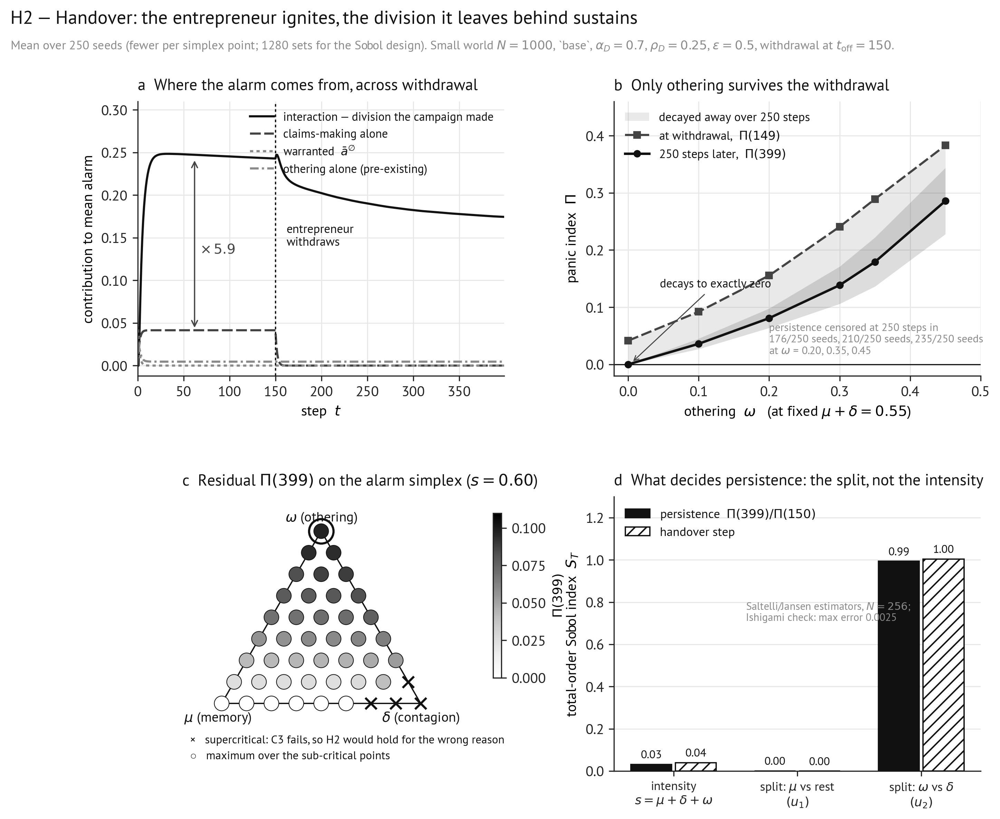

# H2 — Handover: what starts a panic is not what sustains it

**Experiment B of spec §12.1, with the sensitivity design of §12.2. Tests the hypothesis
stated in spec §13.**

> **H2.** Starting from a consensual population, the claims-making-alone term rises first and
> then plateaus, while the **interaction** term rises later and overtakes it. After the
> entrepreneur withdraws at $t_{\text{off}}$, $\Pi$ remains elevated for a duration governed
> by othering rather than by passive decay: on the simplex of §12.2 persistence is maximised
> near the $\omega$ vertex, the split carries a larger total Sobol index than the intensity
> does, and $\Pi$ decays to zero when $\omega=0$ but to a positive floor when $\omega>0$.

All tables below are generated by `../Code/make_report_tables.py h2`.

---

## 1. Design

| Item | Value |
|---|---|
| Setting | small world, $N=1000$, $\langle k\rangle=10$, `base` repertoire, $\alpha_D=0.7$, $\rho_D=0.25$ |
| Withdrawal | $\rho_D\to0$ at $t_{\text{off}}=150$; $C$ silent throughout; $T=400$ |
| Alarm parameters | $\epsilon=0.5$, $\mu=0.30$, $\delta=0.25$, $\omega=0.35$ unless swept |
| Sweeps | $\omega\in\{0\dots0.45\}$; $\epsilon\in\{0.2\dots2.0\}$; **$\alpha_D\in\{0.55\dots0.75\}$ around the gate**; $\sigma\in\{0\dots0.20\}$; position regime |
| Simplex scan | $(p_\mu,p_\delta,p_\omega)$ on a resolution-8 lattice at total intensity $s=0.60$, 45 points |
| Sobol | Saltelli/Jansen on $(s,u_1,u_2)$, $s\in[0,0.6]$, $N=256$ base samples = 1280 sets |
| Seeds | **250** per cell (125 for $\sigma$, 62 per simplex point) |

9 540 counterfactual sets. The `base` repertoire at $\alpha_D=0.7$ is the setting Experiment A
identifies as igniting reliably at moderate reach in a consensual population
([H1 §2.4](H1_ignition.md)).

**The handover criterion is now guarded** (spec §10.3): it is evaluated only while the
entrepreneur is acting. The unguarded version is satisfied by any positive interaction once
claims-alone reaches zero, and fired at $t_{\text{off}}+1$ in most polarized seeds. §2.6 shows
what that repair changes.

**Conditioning.** $\max_t\bar a^{\varnothing}=0.052$ over all seeds, so the panic-index
denominator stays in $[0.948,1]$. The C3 probe passes ($\mu+\delta=0.55$, resting mean alarm
$4\times10^{-53}$). $\bar\Phi(0)=0.067$.

---

## 2. Results

### 2.1 The decomposition across withdrawal (250 seeds, mean)

| $t$ | warranted | claims-alone | othering-alone | **interaction** | $\Pi$ | $q$ |
|---|---|---|---|---|---|---|
| 0 | 0.0501 | 0.0000 | 0.0000 | 0.0000 | 0.0000 | 0.050 |
| 1 | 0.0292 | 0.0169 | 0.0233 | 0.0000 | 0.0414 | 0.069 |
| 2 | 0.0165 | 0.0272 | 0.0198 | **0.0366** | 0.0850 | 0.100 |
| 5 | 0.0028 | 0.0389 | 0.0086 | 0.1477 | 0.1957 | 0.197 |
| 10 | 0.0001 | 0.0413 | 0.0050 | 0.2182 | 0.2646 | 0.260 |
| 20 | 0.0000 | 0.0414 | 0.0046 | 0.2461 | 0.2921 | 0.285 |
| 149 | 0.0000 | 0.0415 | 0.0046 | 0.2430 | 0.2890 | 0.288 |
| **150** | — | — | — | — | — | **← $t_{\text{off}}$** |
| 155 | 0.0000 | 0.0024 | 0.0046 | 0.2378 | 0.2448 | 0.259 |
| 200 | 0.0000 | 0.0000 | 0.0046 | 0.2024 | 0.2070 | 0.220 |
| 300 | 0.0000 | 0.0000 | 0.0046 | 0.1824 | 0.1870 | 0.197 |
| 399 | 0.0000 | 0.0000 | 0.0046 | 0.1745 | 0.1791 | 0.188 |

The interaction is 0 at $t=1$ to machine precision in every seed, as spec §10.1 requires,
becomes non-zero at $t=2$, and runs at **5.94×** claims-alone by $t=20$. Othering-alone stays
at 0.005 throughout. **Handover step = 2 in all 250 seeds.** Persistence after withdrawal is
censored at 250 in 210 of 250 seeds. $\Pi$ retains **62%** of its withdrawal value at $T$.

Interaction channels (§10.1): $\bar\Phi=0.189$ in the full run against $0.006$ in the
othering-only run at $t=149$ — 97% of the othering exposure sustaining the episode is over
distance the campaign created, not distance it re-weighted.

### 2.2 Othering against passive decay

$\omega$ swept at fixed $\mu+\delta=0.55$:

| $\omega$ | $\Pi(149)$ | $\Pi(399)$ | interaction | handover | persistence (censored) |
|---|---|---|---|---|---|
| 0.00 | 0.041 ± 0.001 | **0.000 ± 0.000** | 0.000 | **never** | 2 (0/250) |
| 0.10 | 0.092 ± 0.004 | 0.036 ± 0.009 | 0.049 | 6 (250/250) | 6 (0/250) |
| 0.20 | 0.155 ± 0.008 | 0.081 ± 0.017 | 0.111 | 3 (250/250) | 250 (176/250) |
| 0.30 | 0.241 ± 0.014 | 0.138 ± 0.033 | 0.195 | 2 (250/250) | 250 (201/250) |
| 0.35 | 0.289 ± 0.017 | 0.179 ± 0.043 | 0.243 | 2 (250/250) | 250 (210/250) |
| 0.45 | 0.383 ± 0.017 | 0.286 ± 0.058 | 0.335 | 2 (250/250) | 250 (235/250) |

### 2.3 Tolerance

| $\epsilon$ | 0.20 | 0.30 | 0.40 | 0.50 | 0.70 | 1.00 | 1.50 | 2.00 |
|---|---|---|---|---|---|---|---|---|
| $\Pi(149)$ | 0.320 | 0.312 | 0.306 | 0.289 | **0.045** | 0.045 | 0.045 | 0.045 |
| $\Pi(399)$ | 0.234 | 0.224 | 0.217 | 0.179 | **0.005** | 0.005 | 0.005 | 0.005 |
| interaction | 0.274 | 0.265 | 0.260 | 0.243 | **0.000** | 0.000 | 0.000 | 0.000 |
| handover | 2 | 2 | 2 | 2 | **never** | never | never | never |

### 2.4 The depth gate at fine resolution — does a *graded* handover exist?

The one regime in which H2's phase language could survive is the narrow band where the
campaign is only just deep enough to break bounded confidence. Swept at 250 seeds:

| $\alpha_D$ | $\Pi(149)$ | $\Pi(399)$ | interaction | handover | persistence (censored) |
|---|---|---|---|---|---|
| 0.55 | 0.045 ± 0.001 | 0.005 ± 0.000 | 0.000 | 2 (65/250) | 2 (0/250) |
| 0.60 | 0.046 ± 0.001 | 0.005 ± 0.000 | 0.000 | 2 (250/250) | 2 (0/250) |
| 0.62 | 0.051 ± **0.014** | 0.005 ± 0.000 | 0.004 | 2 (250/250) | 2 (0/250) |
| 0.64 | 0.119 ± **0.064** | 0.008 ± 0.018 | 0.072 | 2 (250/250) | 4 (3/250) |
| 0.66 | 0.236 ± **0.034** | 0.079 ± 0.067 | 0.190 | 2 (250/250) | 114 (85/250) |
| 0.68 | 0.273 ± 0.019 | 0.149 ± 0.052 | 0.227 | 2 (250/250) | 250 (174/250) |
| 0.70 | 0.289 ± 0.017 | 0.179 ± 0.043 | 0.243 | 2 (250/250) | 250 (210/250) |
| 0.75 | 0.305 ± 0.013 | 0.215 ± 0.016 | 0.259 | 2 (250/250) | 250 (250/250) |

**The handover step is 2 at every depth at which it occurs at all.** The transition band
$0.62<\alpha_D<0.68$ is real — the across-seed s.d. inflates four-fold there, so within a
single parameter cell some seeds cleave and others convert — but the *timing* never grades.

Two rows also expose a defect in the criterion itself. At $\alpha_D=0.55$ and $0.60$ the
handover "occurs" while $\Pi=0.045$ and the interaction is 0.000: it is a ratio test, and a
ratio between two near-zero quantities carries no information about whether an episode
happened. **The handover time must be read jointly with $\Pi$**, and is meaningless in cells
where no panic occurs.

### 2.5 The simplex, with the C3 audit applied

The measured C3 probe was run at all 45 lattice points. **Four fail**, all near the $\delta$
vertex, with $\mu+\delta\le0.60$ — comfortably below the $\approx0.7$ figure a scalar bound
would suggest, because an amplifying neighbour enters at weight $\gamma$:

| $(p_\mu,p_\delta,p_\omega)$ | $\Pi(399)$ |
|---|---|
| (0.00, 1.00, 0.00) | **0.585** |
| (0.12, 0.88, 0.00) | **0.461** |
| (0.00, 0.88, 0.12) | **0.231** |
| (0.25, 0.75, 0.00) | 0.038 |

Those points carry the largest raw persistence in the scan. **Excluded**, the ranking inverts:

| $p_\mu$ | $p_\delta$ | $p_\omega$ | $\Pi(399)$ | residual ratio |
|---|---|---|---|---|
| 0.00 | 0.00 | **1.00** | **0.0974** | 0.852 |
| 0.12 | 0.00 | 0.88 | 0.0943 | 0.872 |
| 0.00 | 0.12 | 0.88 | 0.0938 | 0.806 |
| 0.00 | 0.25 | 0.75 | 0.0887 | 0.747 |
| 0.12 | 0.12 | 0.75 | 0.0877 | 0.803 |

Over the 41 sub-critical points the maximum sits **exactly at the $\omega$ vertex**; the top
five average $p_\omega=0.850$.

### 2.6 Variance-based sensitivity

Estimator docked against Ishigami ($N=4096$): maximum absolute error **0.0025** on both $S_1$
and $S_T$ against the analytic values.

| Output | reliable | $S_T(s)$ | $S_T(u_1)$ | $S_T(u_2)$ |
|---|---|---|---|---|
| persistence, $\Pi(399)/\Pi(150)$ | yes | 0.032 | 0.001 | **0.993** |
| handover step | yes | 0.040 | 0.000 | **1.004** |
| $\Pi(399)$ | **no** | 1.755 | 0.172 | 0.376 |

$u_2$ is the $\omega$-versus-$\delta$ dial. On persistence and handover it carries essentially
all the variance while total intensity carries 3–4%. The $\Pi(399)$ row is flagged
`reliable: False` automatically, because $S_T=1.755$ exceeds the theoretical bound of 1 —
near-zero output variance with a large atom at exactly zero. It is reported as estimator
failure, not as a finding.

**The four-input design, with $\zeta$ free (spec §3.2, §12.2).** $\zeta$ is a fixed constant,
but at $\sigma=0$ the permanence of division *is* the frozen state $\zeta$ exists to prevent,
so it competes with $\omega$ through the same channel the anchor uses. Run over two boxes:

| $\zeta$ box | output | $S_T(s)$ | $S_T(u_1)$ | $S_T(u_2)$ | $S_T(\zeta)$ |
|---|---|---|---|---|---|
| $[0,\,0.02]$ — twice the default | persistence | 0.025 | 0.001 | **1.002** | 0.022 |
| | handover step | 0.010 | 0.020 | **0.974** | 0.020 |
| $[0,\,0.05]$ — five times the default | persistence | 0.020 | 0.001 | 0.389 | **0.750** |
| | handover step | 0.030 | 0.020 | **0.964** | 0.030 |

**This did not come out the way the three-input design suggested.** Over the narrow box the
split dominates completely and $\zeta$ is irrelevant. Over the wide box the ordering
**reverses**: noise carries twice the index the split does. The crossover lies between twice
and five times the default, and §2.2's $\omega$ sweep — run at fixed $\zeta=0.01$ — sits
safely inside the region where $\omega$ governs. But the H2 clause now carries a scope
condition rather than standing unconditionally: **persistence is governed by othering provided
$\zeta\lesssim0.02$.** Handover time is untouched in both boxes, so what noise governs is what
*survives*, not when the transfer happens.

### 2.7 The initial position regime, and the anchor

| Regime | $\Pi(149)$ | interaction | othering-alone | handover (guarded) | $\bar\Phi(0)$ |
|---|---|---|---|---|---|
| consensual | 0.289 | **0.243** | 0.005 | 2 (250/250 seeds) | 0.067 |
| polarized | 0.566 | **0.024** | 0.500 | 4 (**28**/250 seeds) | 0.386 |

| $\sigma$ | predicted $-1/\ln(1-\sigma)$ | measured persistence | censored |
|---|---|---|---|
| 0.00 | ∞ | 250 | 111/125 |
| 0.05 | 19.5 | 13 | 0/125 |
| 0.10 | 9.5 | 9 | 0/125 |
| 0.20 | 4.5 | 4 | 0/125 |

---

## 3. Comments to visualization

*Figure 2, produced by [`hypothesis_figures.ipynb`](hypothesis_figures.ipynb).*

H2 has two halves — an accounting claim about where the alarm comes from, and a dynamical
claim about what keeps it there once the entrepreneur leaves. Panels (a) and (b) are the two
halves; panels (c) and (d) are two independent tests of the second.

**Panel (a) — the whole hypothesis in one picture, including the part that is wrong.** The
four decomposition terms through the run, with the dotted vertical at $t_{\text{off}}=150$.
Read it as four separate stories on one axis. *Claims-making alone* (dashed) rises for about
ten steps, plateaus at 0.041, holds flat for 140 steps and drops to zero within five steps of
withdrawal — a forcing term doing exactly what a forcing term should. *Othering alone*
(dash-dot) never leaves 0.005: the consensual-start guarantee, so none of this alarm is
inherited from initial dispersion. *Warranted* (dotted) decays to nothing in twenty steps. And
the *interaction* (solid) rises to 0.246 and stays. The double arrow marks the ratio the
paper's claim rests on: **5.94 to one, endogenous over exogenous.**

The honest reading is also here. H2 describes a *sequence* — claims rises and plateaus, then
interaction rises later and overtakes. The panel shows no such sequence: the solid curve is
already above the dashed one at $t=2$, the first step at which §10.1 permits it to be non-zero
at all. The overtaking is instantaneous because at $\alpha_D=0.7>\epsilon=0.5$ the campaign
severs bounded-confidence ties on contact. What survives is the *composition* claim, not the
phase story — and §2.4 shows there is no depth anywhere at which the phase story is recovered.

Right of the dotted line the solid curve steps down about 15% and then decays so slowly it is
nearly flat over 250 steps, with nothing forcing the system at all. That is the panic
outliving its cause.

**Panel (b) — what the floor is made of.** $\Pi$ at withdrawal and 250 steps later, against
the othering coefficient, with $\mu+\delta$ held at 0.55 so total intensity cannot move. The
shaded gap is what decayed away; the lower line is what did not. At $\omega=0$ the lower line
touches exactly zero — passive decay of memory and contagion together, $-1/\ln(0.55)\approx1.7$
steps, takes it all. Rightward the floor climbs monotonically to 0.29: not merely present but
*proportional to othering*, while the upper line barely changes shape.

The panel plots levels rather than trajectories deliberately. Persistence as §10.3 defines it
is censored at 250 in 176–235 of 250 seeds for every $\omega\ge0.2$ (annotated), so a duration
plot would show a flat ceiling and say nothing. The residual *level* is the quantity with
information in it.

**Panel (c) — the result that exists only because of the C3 audit.** Residual $\Pi(399)$ over
the simplex of alarm splits at fixed intensity $s=0.60$: $\mu$ lower left, $\delta$ lower
right, $\omega$ at the apex, darker meaning more alarm surviving. The circled point at the
apex is the maximum — H2's prediction landing exactly on the vertex, with the top five points
averaging $p_\omega=0.85$.

The four crosses are why the panel is drawn this way. They mark points where the measured C3
probe fails, and in the raw scan they carry the *highest* persistence in the simplex
($\Pi(399)=0.585$ at the $\delta$ vertex against 0.097 at the $\omega$ vertex). Plot the scan
without excluding them and H2 appears refuted; exclude them silently and it appears confirmed
for the wrong reason. Note also *where* they sit: all four near the $\delta$ vertex with
$\mu+\delta\le0.60$, because the boundary is a surface in the simplex, not a value of
$\mu+\delta$ — at that vertex the effective gain $\delta\gamma=1.8$ already exceeds one.

**Panel (d) — the same claim by a method sharing none of the same assumptions.** Total-order
Sobol indices on the reparameterised inputs. $u_2$ carries 0.99 and 1.00; $s$ carries 0.03 and
0.04. H2 predicted the split would carry a larger index than the intensity; it carries
twenty-five times more. That the same answer comes from a variance decomposition over 1280
runs and from a lattice scan in panel (c) is the point of showing both. The Ishigami note is
the estimator's own verification: the hand-written Saltelli/Jansen code reproduces a function
with closed-form indices to 0.0025. The third output, $\Pi(399)$, is not drawn — its total
index for $s$ comes out at 1.755, above the theoretical bound, and the library now flags it
`reliable: False` automatically.

**How the panels connect.** (a) establishes that the alarm is endogenous; (b) that what
survives withdrawal is othering specifically; (c) and (d) that this is a property of the
*split* rather than of intensity, by two independent routes, with the C3 audit ruling out the
case where it would be true for the wrong reason.

---

## 4. Verdict, clause by clause

| # | Clause as specified | Result | Verdict |
|---|---|---|---|
| a | Claims-alone rises first, then plateaus | Plateaus at 0.041 by $t\approx10$, holds to $t_{\text{off}}$ | **Supported** |
| b | Interaction rises **later** and overtakes it | Overtakes at $t=2$ — the earliest permitted step — in 250/250 seeds, and at every depth in the fine sweep | **Supported in magnitude, refuted in ordering** |
| c | Othering-alone stays near zero | 0.005 throughout, against a full-run $\bar\Phi$ of 0.189 | **Supported** |
| d | $\Pi\to0$ at $\omega=0$, positive floor at $\omega>0$ | $\Pi(399)$: 0.000 / 0.036 / 0.081 / 0.138 / 0.179 / 0.286 across $\omega=0\dots0.45$ | **Supported** |
| e | Persistence maximised near the $\omega$ vertex | Maximum exactly at $p_\omega=1.00$ once the four supercritical points are excluded; top five average 0.850 | **Supported, conditional on the C3 audit** |
| f | The split carries a larger total index than the intensity | $S_T$: 0.993 vs 0.032 on persistence; 1.004 vs 0.040 on handover | **Supported** |
| f′ | *(not registered)* …and larger than the index of the noise constant $\zeta$ | $S_T$ 1.002 vs 0.022 over $\zeta\in[0,0.02]$; **0.389 vs 0.750** over $\zeta\in[0,0.05]$ | **Supported only for $\zeta\lesssim0.02$** — the sharpest limit on H2 |
| g | Low $\epsilon$ brings the handover forward | At its floor ($t=2$) for every $\epsilon\le0.5$, never for $\epsilon\ge0.7$ | **Direction supported, gradient absent** — $\epsilon$ is a gate |
| h | Polarized: handover earlier, interaction smaller | Interaction 0.024 vs 0.243 (smaller, as predicted); the guarded handover occurs in only **28 of 250** seeds and not earlier | **Split** — and by §10.3 this cell is *attenuated*, not a clean test |
| i | Persistence governed by $\omega$, not the anchor | At $\sigma>0$ persistence tracks $-1/\ln(1-\sigma)$: 13, 9, 4 against 19.5, 9.5, 4.5 | **Supported — and it is why $\sigma=0$** |

---

## 5. Interpretation

**The handover happens, and it is not close.** At the operating point the entrepreneur's own
signal contributes 0.041 to mean alarm and the division it manufactures contributes 0.246 — a
factor of six, reached within twenty steps and stable for the remaining 130 steps of the
campaign. When the entrepreneur withdraws, 62% of the disproportion is still there 250 steps
later with no claims-making of any kind in the system. This is the paper's central claim in a
number: **a moral panic is ignited by claims-makers but sustained by the population they
divide.**

**But the ordering in H2 as written is wrong, and the fine sweep closes the question.** H2
describes a sequence. What happens instead is that the interaction overtakes claims-alone at
$t=2$, the first step at which it is mathematically permitted to be non-zero, in every seed.
The obvious rescue would be a regime near the depth gate where the transfer is gradual, and
§2.4 tests exactly that at eight depths spanning the gate: **the handover step is 2 wherever
it happens at all.** There is no parameter point in this model at which the panic is the
entrepreneur's for a while and the population's later. The cause is structural — at
$\alpha_D>\epsilon$ a reached agent's ties are severed in one step, so the division is
complete on the first step of contact and othering works on the second.

The consequence for the paper is a wording change, not a retraction. "Ignited by claims-makers,
sustained by the population" is confirmed as an *accounting* statement about where the alarm
comes from. It is not confirmed as a *narrative* about phases, and should not be written as
one.

**The transition band is bistable, which is a finding in its own right.** Between
$\alpha_D=0.62$ and $0.68$ the across-seed s.d. of $\Pi$ inflates four-fold (0.014 → 0.064)
while the mean climbs. Within one parameter cell some seeds cleave and others convert,
depending on which agents happened to be reached first. That is the model's only genuinely
knife-edge behaviour, and it sits in depth rather than in reach — the opposite axis from where
H1 looked for a discontinuity.

**Persistence is othering, and this survives the sharpest test available.** At $\omega=0$ the
index decays to exactly zero, and persistence is two steps, matching the passive decay
$-1/\ln(\mu+\delta)\approx1.7$ steps that §7.4 predicts. At $\omega>0$ it decays to a floor
rising monotonically with $\omega$. On the simplex, once supercritical points are removed,
persistence is maximised at the $\omega$ vertex itself. And in the Sobol decomposition the
split explains 99% of the variance at fixed intensity while intensity explains 3%. Three
independent instruments, one answer.

**The C3 audit is what makes that claim mean anything.** Without it the simplex says the
opposite: raw persistence peaks at the $\delta$ vertex, $\Pi(399)=0.585$ against 0.097 at the
$\omega$ vertex. That point is supercritical — alarm self-sustains from any positive seed
regardless of any claims-maker — and is exactly what §3.3 warns will make H2 true for the
wrong reason. Three things follow: the audit must run at every reported point; $\mu+\delta$ is
**not** an adequate proxy, since all four failures have $\mu+\delta\le0.60$; and §3.3's
sentence needed correcting, which it now has been.

**Tolerance and depth are one gate seen from two sides.** H2 predicts low $\epsilon$ brings
the handover forward. The direction is right — high $\epsilon$ abolishes the handover
entirely — but there is no gradient, because the handover is already at its floor for every
$\epsilon<\alpha_D$ and never occurs above. The switch sits at
$\epsilon\approx\alpha_D(1-\bar b)$, exactly where a reached agent's displacement stops
exceeding its neighbours' tolerance.

**The polarized contrast is not a test, and the guarded criterion now says so cleanly.** The
polarized regime produces the largest $\Pi$ in the study (0.566) with the *smallest*
interaction (0.024): almost all of it is othering-alone at 0.500, alarm over division that
existed before anyone acted. Under the old unguarded criterion this cell reported a handover
at $t_{\text{off}}+1$ in most seeds — arithmetic, since claims-alone had reached zero. Guarded,
the handover occurs in 28 of 250 seeds and the cell reads as what it is: attenuated. The
substantive reading H2 offers — an already-divided population needs less entrepreneurship — is
supported by the interaction being an order of magnitude smaller; the timing claim cannot be
evaluated with this instrument.

**The anchor caution reproduces at 125 seeds.** Persistence at $\sigma=0.05,0.10,0.20$ is 13,
9 and 4 steps against the predicted 19.5, 9.5 and 4.5 — tracking the anchor's relaxation time
and not $\omega$, exactly as §3.2 warns. Fixing $\sigma$ positive and leaving it outside the
analysis would have handed the entire H2 result to a constant nobody was looking at.

---

## 6. Discussion

H2 is the load-bearing hypothesis: §13 states that H3 has a mechanism only if H2 holds, and
that if H2 fails the claim of §1.2 fails with it. On this evidence it holds in the strong
form — the endogenous term dominates by a factor of six during the campaign, 62% of the
disproportion survives 250 steps of withdrawal, and its persistence is governed by the
othering coefficient rather than by memory, contagion, or total alarm intensity.

The theoretical payoff is the one §1.2 promises. The dispute between elite-driven and
interactionist accounts has been conducted rhetorically because nobody could apportion the
two, and the four-run decomposition apportions them: at the operating point **14%** of the
manufactured alarm is the entrepreneur's signal, **2%** is pre-existing division, and **84%**
is the interaction — division the entrepreneur created, amplified by a population that then
found its own divisions frightening. Neither camp is right as usually stated. The entrepreneur
is necessary (at $\rho_D=0$ nothing happens) and nearly irrelevant to the magnitude. What it
does is manufacture the condition under which the population alarms itself, and it can then
leave.

The corollary belongs in the abstract: **withdrawing the claims-making that started a panic
does not remove what is keeping it going.** In the model the entrepreneur literally cannot end
what it started; the only thing returning $\Pi$ to zero is $\omega=0$, a population that does
not find disagreement frightening. That is a different policy object from "stop the media
campaign", and the model makes the difference computable.

Five caveats bound this.

**(i) The immediate handover is a specification result, not a finding about panics.** With
bounded confidence, no repulsion and a synchronous update, division created by a
supra-tolerance push is complete in one step. Real division is not. The claim that survives is
about *composition*, not *timing*, and §2.4 establishes that no depth rescues the timing
version.

**(ii) Persistence at $\sigma=0$ is unbounded by construction.** Bounded confidence at
$\sigma=0$ is absorbing: clusters more than $\epsilon$ apart can never re-merge, so the floor
never decays and 210 of 250 seeds are censored. This is the correct default for isolating
$\omega$, but it means "alarm outlives its cause" is demonstrated as *bounded below* rather
than measured as a duration. The residual level $\Pi(399)$ is the better statistic, which is
why the Sobol analysis uses the residual ratio.

**(iii) The handover time is a ratio test and needs a level test beside it.** §2.4 shows it
firing at $\alpha_D=0.55$ where $\Pi=0.045$ and the interaction is 0.000 — a ratio between two
near-zero quantities. It should be reported only for cells that meet the panic criterion of
§10.2, and never on its own.

**(iv) The $\Pi(399)$ Sobol row is unusable and is flagged as such.** $S_T=1.755$ violates the
estimator's bound. Reporting it would be an error; if that output is wanted it needs a larger
$N$ and probably a rank transform.

**(v) The persistence result carries a scope condition in $\zeta$, and it is the most
attackable point in the paper.** Othering governs persistence provided position noise stays
below roughly twice its default; at five times the default, noise governs instead. The
operating point sits inside the safe region and the $\omega$ sweep is run there, so nothing
reported above is affected — but the claim is conditional, the condition is not derivable from
anything in the model, and it should be stated wherever the H2 result is. Substantively it
says the permanence of manufactured division depends on agents not drifting back across the
tolerance boundary, which is an assumption about how noisy moral positions are that this model
cannot settle. Note the asymmetry with $\sigma$: the anchor's effect is signed and predictable
($-1/\ln(1-\sigma)$), whereas $\zeta$'s is a threshold whose location had to be measured.

**(vi) The counterfactual-validity horizon bounds how late-run numbers may be read.** In three
of five audited seeds the within-arm noise passes 10% of the full-versus-null gap somewhere
between $t=191$ and $t=289$ ([appendix](appendix_robustness.md) §6). Everything read at or
before withdrawal sits far inside that. $\Pi(399)$ does not, and is therefore reported as a
distribution over seeds and never as a trajectory.

The boundary artifact of §14.2 has been checked and does not bite: the interior bimodality
coefficient matches the raw one to three decimals, and replicating under a bound that never
pins anyone leaves $\Pi(149)$ at 0.284 against 0.292. The decomposition was never exposed to
it in any case — it reads alarm, not positions — and the $t=1$ zero-interaction property holds
to machine precision in every seed, which is direct evidence that no clip binds on the alarm
channel. One further constant is *not* inert, however, and §2.6 now measures rather than brackets it:
$\zeta$ competes with $\omega$ for persistence, decisively so above twice its default. §3.2
has been corrected to fix $\zeta=0.01$ under a stated scope condition rather than by fiat, and
§12.2 now carries $\zeta$ as a fourth input.
