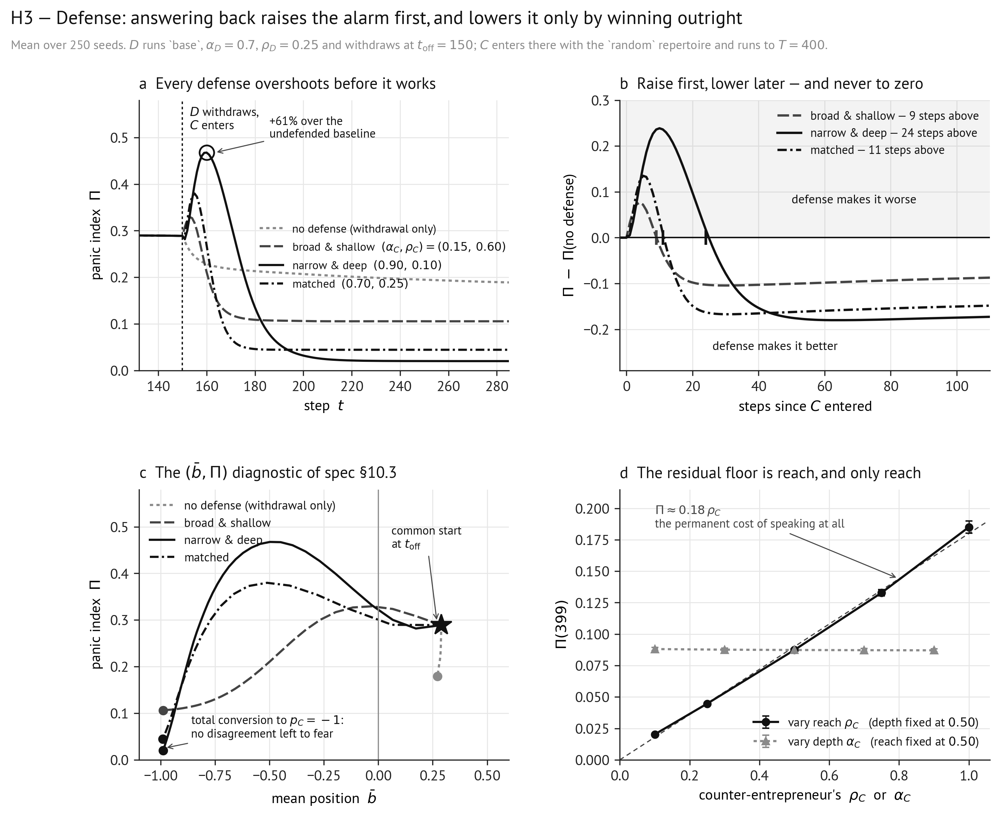

# H3 — Defense: answering back need not lower the alarm, and may raise it

**Experiment C of spec §12.1. Tests the hypothesis stated in spec §13.**

> **H3.** A counter-entrepreneur acts through two channels that pull opposite ways: an
> **immediate cost** scaling with $\rho_C$ (every agent it reaches gains a maximally alarmed
> contact of weight $\gamma$ in $E_i$, and alarm is undirected), and a **delayed benefit**
> scaling with $\alpha_C$ (any reduction in $\Phi$ requires actually moving positions, and is
> not guaranteed in sign: pulling agents toward $p_C=-1$ narrows moral distance only if it
> moves them toward the population's bulk).
>
> Both readings were fixed in advance. If broad-and-shallow lowers $\Pi$ while narrow-and-deep
> raises it, defense works but only through reach. If **no** configuration lowers $\Pi$,
> counter-claims-making is structurally self-defeating in this model.

---

## 1. Design

$D$ runs the setting Experiment A identifies as most escalating (`base`, $\alpha_D=0.7$,
$\rho_D=0.25$, small world, $N=1000$) and withdraws at $t_{\text{off}}=150$. $C$ enters at
$t_{\text{off}}$ with the `random` repertoire and runs to $T=400$. This is the only experiment
in which both actors appear, and they are staggered rather than simultaneous.

| Configuration | $(\alpha_C,\rho_C)$ | Represents |
|---|---|---|
| none | (—, 0) | withdrawal only; the H2 baseline |
| broad and shallow | (0.15, 0.60) | a wide public campaign of reassurance |
| narrow and deep | (0.90, 0.10) | intensive mobilization of a small defense |
| matched | (0.70, 0.25) | a symmetric answer to the entrepreneur |

In this experiment the "claims-making on" arms of the 2×2 include $C$'s entry, so $\Pi$
measures excess over a world with no organized claims-making of either kind (§12.1). **250
seeds** per configuration. A supplementary one-at-a-time probe varies $\rho_C$ at
$\alpha_C=0.50$ and $\alpha_C$ at $\rho_C=0.50$ over 125 seeds, to read the sign of each
channel separately. 2 250 counterfactual sets in all; tables generated by
`../Code/make_report_tables.py h3`.

---

## 2. Results

### 2.1 The panic index around $C$'s entry (250 seeds, mean)

| $t$ | none | broad & shallow | narrow & deep | matched |
|---|---|---|---|---|
| 149 | 0.289 | 0.289 | 0.289 | 0.289 |
| 152 | 0.266 | **0.324** | 0.300 | **0.322** |
| 155 | 0.245 | 0.317 | **0.399** | **0.380** |
| 160 | 0.229 | 0.211 | **0.467** | 0.269 |
| 165 | 0.222 | 0.143 | 0.414 | 0.131 |
| 175 | 0.215 | 0.112 | 0.214 | 0.051 |
| 200 | 0.207 | 0.106 | 0.032 | 0.045 |
| 399 | 0.179 | **0.106** | **0.020** | **0.045** |

| Configuration | peak $\Pi$ after entry | max excess over baseline | steps above baseline | $\Delta\Pi(399)$ (paired) | seeds lowering $\Pi$ |
|---|---|---|---|---|---|
| broad & shallow | 0.329 at $t=153$ | **+0.077** at $t=154$ | 9 / 250 | −0.073 ± 0.043 | 95% |
| narrow & deep | 0.467 at $t=160$ | **+0.239** at $t=160$ | 24 / 250 | −0.159 ± 0.043 | 98% |
| matched | 0.380 at $t=155$ | **+0.135** at $t=155$ | 11 / 250 | −0.135 ± 0.043 | 98% |

### 2.2 What the defense does to the population

| $t$ | none | broad & shallow | narrow & deep | matched |
|---|---|---|---|---|
| 149 | $\bar b=+0.29$, $\bar\Phi=0.189$ | +0.29, 0.189 | +0.29, 0.189 | +0.29, 0.189 |
| 160 | +0.28, 0.184 | −0.50, 0.034 | −0.50, **0.309** | −0.81, 0.083 |
| 180 | +0.28, 0.181 | −0.93, 0.007 | −0.92, 0.068 | −0.99, 0.005 |
| 399 | +0.27, 0.162 | **−0.99, 0.005** | **−0.99, 0.005** | **−0.99, 0.005** |

Every configuration converts the entire population to $C$'s pole and drives othering exposure
to 0.005 — the same value the null run carries.

### 2.3 The two channels, isolated

| $\rho_C$ (at $\alpha_C=0.50$) | 0.10 | 0.25 | 0.50 | 0.75 | 1.00 |
|---|---|---|---|---|---|
| $\Pi(399)$ | 0.020 | 0.045 | 0.087 | 0.133 | **0.185** |

| $\alpha_C$ (at $\rho_C=0.50$) | 0.10 | 0.30 | 0.50 | 0.70 | 0.90 |
|---|---|---|---|---|---|
| $\Pi(399)$ | 0.088 | 0.088 | **0.087** | 0.087 | 0.087 |

Residual disproportion is linear in reach ($\Pi(399)\approx0.18\rho_C$) and exactly flat in
depth.

---

## 3. Comments to visualization

*Figure 3, produced by [`hypothesis_figures.ipynb`](hypothesis_figures.ipynb). Mean over 250
seeds (125 in panel d).*

H3 asked a yes-or-no question and the answer is a shape, so the figure is arranged to make
the shape unmissable: (a) shows it happening, (b) isolates it against the right baseline, (c)
says what the population had to do to get there, and (d) says what it costs permanently.

**Panel (a) — the overshoot.** $\Pi$ through $C$'s entry, all four configurations on one
axis, zoomed to the 150 steps where anything happens. Every line starts at the same value by
construction: up to $t_{\text{off}}$ the runs are identical, which is what makes the
comparison clean. Read what happens immediately after the dotted line. The undefended
baseline (light dotted) decays gently — that is the H2 result, alarm outliving its cause.
Every other line goes *up* first. The circled peak belongs to narrow & deep at $t=160$:
$\Pi=0.467$, 61% above what the panic would have been had nobody answered back. Then all
three fall, and fall below the baseline, and stay there.

The counter-intuitive ordering is the substance. The configuration that overshoots most is
the one with the *lowest* reach ($\rho_C=0.10$), which rules out the immediate-cost channel
as the explanation — that channel scales with $\rho_C$ and would predict broad & shallow to
be worst. What is doing it is H3's second bullet: pulling agents toward $p_C=-1$ narrows
moral distance only if it moves them toward the bulk, and at $t=150$ the bulk sits at
$\bar b=+0.29$. Taking a tenth of the population to $-1$ in a single step does the opposite.

**Panel (b) — the same thing measured against the counterfactual that matters.** Each
configuration minus the undefended baseline, so the zero line is "the defense changed
nothing". Read the sign, then the duration. Every curve is positive for its first 9–24 steps
— the counts are in the legend, and the tick on the zero line marks each crossing — and
negative thereafter. This is why H3's two pre-registered branches both fail: the question
"does defense lower $\Pi$ or raise it" has no single answer, because the answer changes sign
at a step that depends on the configuration. Reporting only the endpoint would have said
"defense works"; reporting only the transient would have said "defense backfires". The panel
is the argument that neither summary is honest.

Note also that no curve returns to zero from below. The defense does not merely undo the
panic; it drives $\Pi$ below what withdrawal alone would have achieved, which is panel (c)'s
subject.

**Panel (c) — the diagnostic §10.3 specifies, and what it reveals.** The $(\bar b,\Pi)$
plane, each configuration traced from $t_{\text{off}}$ (the star, shared) to $t=400$ (the
dot). The spec proposes this pair as the way to tell winning the argument from winning the
panic: "a response that moves $\bar b$ toward its own pole while $\Pi$ rises has won the
argument and lost the panic." Read the trajectories leftward. All three defended runs loop
up and to the left — $\Pi$ rising while $\bar b$ falls — and then descend to a common
endpoint at $\bar b\approx-0.99$ with $\Pi$ near zero. The undefended run barely moves: it
sits at $\bar b\approx+0.27$ with $\Pi\approx0.18$ for 250 steps.

The endpoint is the finding. The defense lowers the alarm by converting the entire population
to its own pole, at which point $\bar\Phi$ falls to 0.005 — the value of a population with
nothing to other. It does not reassure anyone; there is no message in this model that says
*there is no threat* (§14.1). The only route available is to eliminate the disagreement, and
the panel shows it being taken to the limit. The loop on the way there is the overshoot of
panels (a) and (b), seen as what it is: a detour through *more* division before less.

**Panel (d) — the price of speaking, isolated.** Residual $\Pi$ at $t=400$ against each of
$C$'s two levers, one at a time. The two lines could hardly be more different: varying reach
traces a straight line through the origin, and varying depth traces a flat one. The dashed
guide is $\Pi=0.18\rho_C$, and the reach line sits on it. Read this together with §7.4: every
claims-maker enters the alarm neighbourhood of everyone it reaches as one maximally alarmed,
permanently amplifying contact, and alarm is undirected, so a message that a threat exists is
alarming whoever sends it. Once the population is fully converted and $\bar\Phi$ has
collapsed, that contact is *all* that is left — which is why the floor is exactly
proportional to reach and completely indifferent to depth (0.087 at every $\alpha_C$ from
0.10 to 0.90).

The practical reading: **a defense can never lower the panic index below what its own
broadcasting costs.** Broad & shallow, the configuration meant to represent a wide public
campaign of reassurance, ends with five times the residual alarm of the narrow campaign — not
because it reassures worse, but because it keeps talking to more people.

**How the panels connect to the rest.** The mechanism in panel (a) is the same depth-versus-
tolerance gate that governs ignition in H1 (panel d there) and the handover in H2, now
operated by the other side: $\alpha_C=0.90$ exceeds $\epsilon=0.5$ and cleaves, $\alpha_C=0.15$
does not and converts. The model has one way of manufacturing division and does not care who
uses it. Panel (c)'s endpoint is only reachable because H2's floor is othering-driven —
remove the moral distance and the floor goes with it — which is why §13 says H3 has a
mechanism only if H2 holds.

---

## 4. Verdict, clause by clause

| # | Clause as specified | Result | Verdict |
|---|---|---|---|
| a | An immediate cost scaling with $\rho_C$, landing on the first step | Every configuration raises $\Pi$ above baseline within 2–4 steps; the permanent floor is $\Pi(399)\approx0.18\rho_C$, exactly linear in reach and flat in depth | **Supported** |
| b | A delayed benefit, slow at low $\alpha_C$ | All configurations eventually lower $\Pi$; the crossing happens at $t\approx159$ (broad), $t\approx174$ (narrow), $t\approx161$ (matched) | **Supported** |
| c | The benefit is not guaranteed in sign: pulling toward $p_C$ *increases* dispersion first if the bulk sits near $p_D$ | narrow & deep drives $\bar\Phi$ from 0.190 up to **0.309** and $\Pi$ to 0.467 — 61% above the undefended baseline — before collapsing | **Supported, and it is the largest effect in the experiment** |
| d | Branch 1: broad-and-shallow lowers $\Pi$, narrow-and-deep raises it | Both lower it at the horizon; narrow-and-deep lowers it *further* (0.020 vs 0.106) | **Refuted** |
| e | Branch 2: no configuration lowers $\Pi$ (the "structurally self-defeating" branch) | All three lower it, in 95–98% of 250 seeds | **Refuted** |
| f | The diagnostic is the pair $(\bar b,\Pi)$: moving $\bar b$ to one's own pole while $\Pi$ rises means winning the argument and losing the panic | $\bar b$ goes to −0.99 in all three, and $\Pi$ falls — the argument and the panic are won together, by conversion | **Neither branch of the pre-specified diagnostic** |

---

## 5. Interpretation

**Both pre-registered branches are wrong, and the truth is a sequence rather than a sign.**
H3 asked a directional question — does defense lower $\Pi$ or raise it — and specified two
possible answers. The answer is: **first raise, then lower, and never to zero.** Every
configuration overshoots the undefended baseline for 9 to 24 steps and then falls below it
permanently. Reporting only the endpoint would have said "defense works"; reporting only the
transient would have said "defense backfires". Both are true of the same run.

**The transient is the mechanism H3 named, working exactly as described.** The largest
overshoot belongs to narrow-and-deep — the configuration with the *lowest* reach, and
therefore the smallest immediate cost. That is not the immediate-cost channel; it is the
second bullet of H3, the one that says pulling agents toward $p_C$ narrows moral distance
only if it moves them toward the bulk. At $t=150$ the bulk sits at $\bar b=+0.29$. A
counter-entrepreneur with $\alpha_C=0.90$ takes 10% of the population to $-1$ in a single
step, which does not narrow the distance to the bulk, it maximises it: $\bar\Phi$ rises from
0.190 to 0.309, and $\Pi$ climbs to 0.467, 61% above what the panic would have been had
nobody answered back. The defense of the stigmatized position, mounted intensively on a small
base, is briefly the single most panic-generating act in the whole study.

**The eventual reduction is conversion, not reassurance.** In all three configurations $\Pi$
falls because $\bar b$ goes to $-0.99$ and $\bar\Phi$ collapses to 0.005 — the value of a
population with nothing to other. The counter-entrepreneur does not calm anyone; it wins
totally, and a population that agrees about everything has no moral distance to be alarmed
by. This is the only route the specification leaves open (§14.1: *no actor can reassure*),
and it is worth being blunt about what it means: in this model the way to end a moral panic
is to eliminate the disagreement, in either direction. The entrepreneur could have done the
same thing by converting everyone to $+1$ — and in Experiment A, at $\alpha_D$ below the
depth gate, it does exactly that, with $\Pi$ falling to the same kind of floor.

**Depth decides how much damage the defense does on its way to winning.** Broad-and-shallow
($\alpha_C=0.15$) never exceeds tolerance: reached agents move 0.19 per step, stay audible to
their neighbours, and drag the population along together, so $\bar\Phi$ *falls* immediately
(0.034 by $t=160$) and the overshoot is small (+0.077 for 9 steps). Narrow-and-deep
($\alpha_C=0.90$) severs ties on contact and cleaves the population again before healing it.
This is the same $\alpha$-versus-$\epsilon$ gate that governs ignition in H1 and the handover
in H2, now running on the other side of the contest. The model has one mechanism for
manufacturing division, and it does not care who operates it.

**There is a permanent floor, and it is pure reach.** With the population fully converted and
$\bar\Phi$ at its null value, $\Pi(399)$ is 0.106, 0.045 and 0.020 for the three
configurations — and the one-at-a-time probe shows why: residual disproportion is
$\approx0.18\rho_C$, linear in reach and *exactly flat* in depth (0.087 at every $\alpha_C$
from 0.10 to 0.90). That floor is the immediate-cost channel of H3, made permanent: as long
as $C$ keeps speaking, every agent it reaches counts a maximally alarmed contact of weight
$\gamma$ in $E_i$, and alarm is undirected. **A defense can never lower the panic index below
what its own broadcasting costs.** Broad-and-shallow, the configuration that represents a
wide public campaign of reassurance, therefore ends with five times the residual alarm of the
narrow campaign — not because it reassures worse, but because it keeps talking to more
people.

---

## 6. Discussion

The finding worth carrying into the paper is not "defense works". It is the shape of the
trade-off, which is sharper than either branch H3 anticipated:

1. **Answering back is most dangerous exactly when it is most committed.** Intensity, not
   volume, produces the overshoot, because intensity is what tears the population apart.
2. **Answering back only ever works by winning outright.** There is no configuration that
   lowers alarm while leaving the disagreement standing.
3. **Answering back has a floor set by its own reach.** Speaking is alarming, so a campaign
   that must stay broad to be heard pays for its breadth forever.

Together these say something specific about the asymmetry between making a panic and unmaking
one. It is not that the entrepreneur has more resources — the matched configuration gives $C$
exactly $D$'s depth and reach and it lowers $\Pi$ by 0.139. It is that the two acts are not
symmetric operations on the same object: making a panic requires only creating division,
which one supra-tolerance push accomplishes, while unmaking one requires eliminating
division, which requires converting *everybody*, which takes 30–50 steps of uninterrupted
access. In a contest where $D$ could re-enter, the defense would never get that window.

Three limits bound this strongly.

**(i) The result is conditional on the absence of a reassurance channel, and §14.1 says so.**
Every claims-maker enters the alarm neighbourhood of everyone it reaches as a maximally
alarmed contact; there is no message that says *there is no threat*. That is why the floor
$0.18\rho_C$ exists and why conversion is the only available route. The extension that would
settle it — an actor with a signed effect on alarm — is named in §14.1 and is not
implemented. Until it is, "defense lowers the panic only by conversion" should be reported as
a property of this specification, not as a finding about counter-panic. This is the mirror
image of the caveat §14.1 attaches to the *other* branch, and it applies with equal force to
the branch the runs actually support.

**(ii) $C$ acts unopposed for 250 steps.** $D$ withdraws permanently at $t_{\text{off}}$ and
never returns, so the conversion result depends on a window no real contest would grant.
Spec §14.1 lists this: claims-makers do not learn, and Experiment C provides a one-shot
response and nothing more. The transient overshoot — which happens in the first 24 steps —
is far more robust to this than the endpoint is, and the paper should weight it accordingly.

**(iii) Conversion to $-0.99$ is helped by $\sigma=0$ and by static networks.** With no anchor
there is nothing pulling agents back toward their pre-campaign positions, and with no
rewiring there is no homophilous sorting to resist a uniform pull. Both omissions push in the
direction of easier conversion, so the endpoint result is the optimistic bound on what a
defense can achieve. The overshoot, again, is not.

A last observation for the theory. The model reproduces, without being asked to, a pattern
the literature describes qualitatively: that the organized defense of a stigmatized group
frequently intensifies the episode before it ends it, and that the most militant defense
intensifies it most. In the model this is not a story about backlash, tone, or provocation —
none of which exist here. It is arithmetic on moral distance: the defense's own supporters
become the population's most distant neighbours, and distance is what alarms. That is a
mechanism the constructivist literature can test without adopting anything else in this
model.
